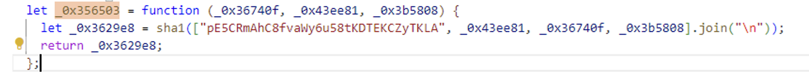
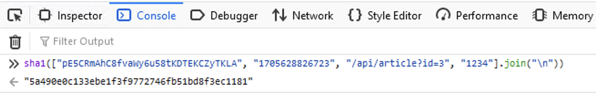

#### Things to learn: BurpSuite Extension Creation, SQL Injection(Basic)

## Lab Information
This lab draws inspiration from Brett Buerhaus, also known as Ziot (Twitter/X: @bbuerhaus). Brett stumbled upon a web application during a BugBounty program, where the frontend JavaScript was responsible for generating signatures, ostensibly to craft "secure" requests to the application's API.

For a detailed account of Brett's findings, check out his blog entry:

https://buer.haus/2024/01/16/reversing-and-tooling-a-signed-request-hash-in-obfuscated-javascript/

Your challenge is to delve into the JavaScript code, leveraging your skills to forge your own signed requests. The ultimate goal is to uncover the contents associated with article ID 3. Be aware that this endeavor will necessitate exploiting a secondary vulnerability within the application.

## TL;DR
- Requests are signed using the sha1.js code and predefined values that can be seen after deobfuscating main.js
- Quick try on /api/article API for id 3 or anything more and updating Sign header by running JS code would give 'Article not found'. Article 1 response shows an interesting parameter i.e. live=1.
- Need to automate signing to try other attacks. Basic SQLi on 'id' parameter works. Read below for payload.

## Recon - Initial Thoughts
1. Clearly the question asks us to review the JS code and look at the signing of the requests. That's a hint!
2. We need to find the details of article ID 3.
3. The JS signing of request is not enough and we need to find another vulnerability.
4. /api/article?id=1 is called to get the data of article in JSON format.

## Analysis - Working on these leads one by one.
### 1. JS Code and request signing
- The burp proxy logs show us that two JS files are being requested by the website. main.js and sha1.js.
- sha1.js code is readable and looks like an implementation of the SHA1 encryption.
- main.js code is obfuscated. Here I went through the Brett's finding and learnt that we can use an online de-obfuscater very easily.
- After deobfuscating using Obfuscator.io, main.js has the signature that we are interested in understanding the logic of.
-  This method is being used to generate the value of header 'Sign' and the arguments passed to this are
    - pathWithQueries
    - currTimeStamp
    - user-id
- So for the id=1 article, the function is called as sha1(["pE5CRmAhC8fvaWy6u58tKDTEKCZyTKLA", currTimeStamp, pathWithQueries, userId].join("\n"));
- Now we can create signature for any request and not get the default 'Please refresh page' that is got if we provide incorrect signature.

### 2. Figuring out article 3
- My first thought was let's just try the '/api/article?id=' API that is called when you select an article and find the details for id 3 using the Repeater. Here we provide the correct signature by calling the JS function in the website console.

- 'Article Not Found' was returned in the response.
- Another thing to note is that for articles 1 and 2 we can see a property 'live' in the response that has value 1. So, there could be 2 reasons for article not found error.
    1. The article is only returned to user if live is 1. And for article 3, the value of live is 0.
    2. The article is only authorized to a particular user and not to '1234' default user id.
- Naturally, I tried to play around both live and user-id, but no luck. The key here is to not spend too much time on a lead if it's not returning even a little success.

### 3. Auto signing of requests and SQLi
- To start attacking other parts of the requests, we need a script that changes the signature in our request if the pathWithQueries, currTimeStamp or userId changes. Luckily the website doesn't check for timestamp so we can keep that constant. One can check that by sending same timestamp in multiple requests.
- Also indicated by Brett's article, we need to create a BurpSuite extension that does that for us. Since I used montoyaAPI and Java for building the extension, I had trouble running the JS code from Java. I ended up calling the JS code with little changes through a shell command and read the signature from returned result.

- This extension would update the Sign header value according to the request's path and User-Id header value. Timestamp was kept constant throughout.
- Writing a burp extension was a learning topic for me and I would recommend taking your time here if you are writing for the first time.
- The only good place to start attacking seems to be 'id' query parameter in the /api/article?id= API, and the first idea is to try SQLi since it can be a low hanging fruit.
- And it works. Note that the id parameter is an integer so the ' or '1'='1 might not work as a basic SQLi payload.
- Working on the live=0 guess, one can modify the value as "/api/article?id=5+or+live%3d0". This returns the details of the article 3 and the FLAG.

## Questions that may arise?
1. How did the payload work if we think that live==1 check is present and only those articles are returned?
    - Not sure. It could be that the SQL query may have that check in the query itself and 'or live=0' is overriding it.
2. Is the extension really working?
   - You will see that you'll get 'Article Not Found' error instead of 'Please refresh page' indicating it is working. Although you will not be able to see the updated signature in the Repeater tab.


## References / Code Snippets
### 1. BurpSuite Extension Request Interceptor Logic
```java

burpHttp.registerHttpHandler(new HttpHandler() {
    @Override
    public RequestToBeSentAction handleHttpRequestToBeSent(HttpRequestToBeSent requestToBeSent) {
        HttpRequest httpRequest = requestToBeSent;
        if (requestToBeSent.hasHeader("Sign")) {
            String signature = "";
            String time = String.valueOf(System.currentTimeMillis());
            Runtime rt = Runtime.getRuntime();
            String[] commands = {"node", "C:\\modified-sha1-with-input.js", requestToBeSent.path(), requestToBeSent.headerValue("User-Id"), time};
            Process proc;
            try {
                proc = rt.exec(commands);
                BufferedReader stdInput = new BufferedReader(new InputStreamReader(proc.getInputStream()));
                signature = stdInput.readLine();
                System.out.println(signature);
            } catch (IOException e) {
                throw new RuntimeException(e);
            }
            httpRequest = requestToBeSent
                    .withHeader("Sign", signature)
                    .withHeader("Time", time);
        }
        return RequestToBeSentAction.continueWith(httpRequest);
    }

    @Override
    public ResponseReceivedAction handleHttpResponseReceived(HttpResponseReceived responseReceived) {
        return ResponseReceivedAction.continueWith(responseReceived);
    }
});
